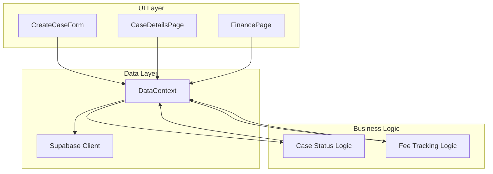
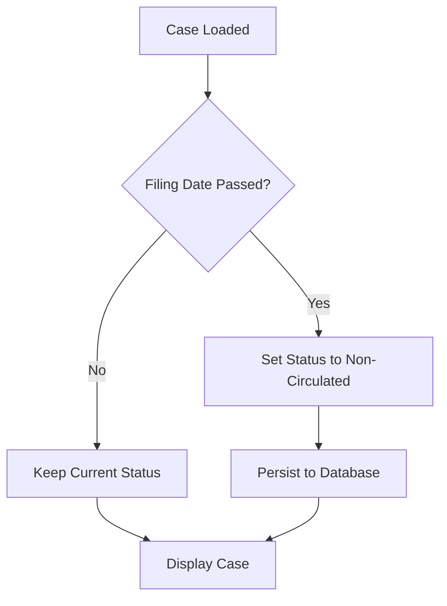
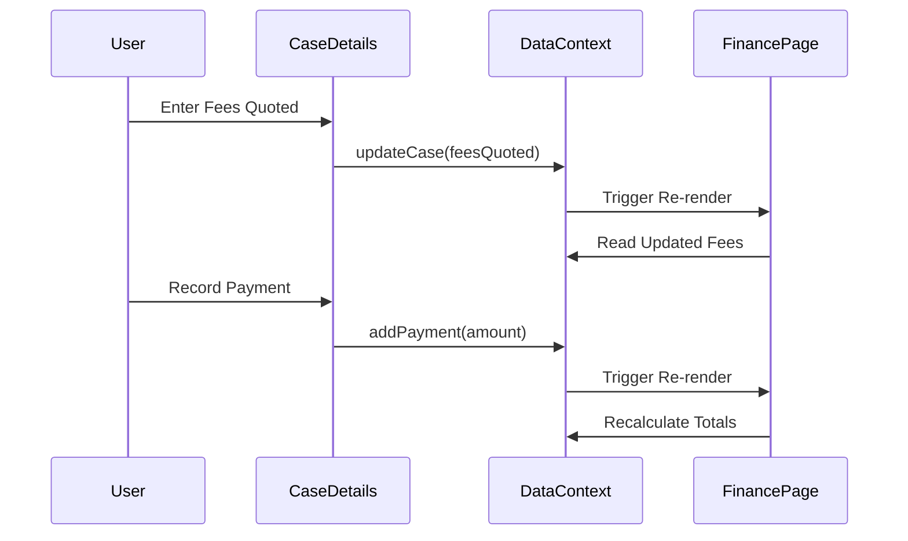

# Design Document: Case Form Enhancements

## Overview

This feature enhances the case management system with improved form fields, automatic case status updates, and dynamic fee tracking. The implementation involves modifications to the CreateCaseForm component, CaseDetailsPage, and integration with the Finance page for real-time fee synchronization.

## Architecture



## Components and Interfaces

### 1. CreateCaseForm Component Updates

**Changes:**
- Replace "On Behalf Of" text input with dropdown containing: Petitioner, Applicant, Appellant, Respondent, Intervenor
- Remove "Payment Mode" field from the form
- Keep "Fees Quoted" field for dynamic fee tracking

**Interface:**
```typescript
interface OnBehalfOfOption {
  value: string;
  label: string;
}

const onBehalfOfOptions: OnBehalfOfOption[] = [
  { value: 'petitioner', label: 'Petitioner' },
  { value: 'applicant', label: 'Applicant' },
  { value: 'appellant', label: 'Appellant' },
  { value: 'respondent', label: 'Respondent' },
  { value: 'intervenor', label: 'Intervenor' }
];
```

### 2. CaseDetailsPage Component Updates

**Changes:**
- Add "NOC" option to case status dropdown
- Rename "Circulation Date" to "Grant Date" in circulation tab
- Implement automatic status update logic based on filing date
- Integrate dynamic fee tracking with payments

**Case Status Options:**
```typescript
const caseStatusOptions = [
  { value: 'pending', label: 'PENDING' },
  { value: 'active', label: 'ACTIVE' },
  { value: 'noc', label: 'NOC' },
  { value: 'disposed', label: 'DISPOSED' },
  { value: 'closed', label: 'CLOSED' }
];
```

### 3. Automatic Case Status Logic

**Logic Flow:**


### 4. Dynamic Fee Tracking

**Data Flow:**


## Data Models

### Case Model Updates

```typescript
interface Case {
  id: string;
  clientName: string;
  // ... existing fields
  onBehalfOf: 'petitioner' | 'applicant' | 'appellant' | 'respondent' | 'intervenor';
  status: 'pending' | 'active' | 'noc' | 'disposed' | 'closed';
  circulationStatus: 'non-circulated' | 'circulated';
  grantDate?: Date;  // Renamed from circulationDate
  filingDate: Date;
  feesQuoted: number;
  feesPaid: number;
  // ... other fields
}
```

### Payment Model

```typescript
interface CasePayment {
  id: string;
  caseId: string;
  amount: number;
  date: Date;
  receivedBy: string;
  paymentMode: string;
  referenceId: string;
  tds: number;
  isAccepted: boolean;
}
```

## Correctness Properties

*A property is a characteristic or behavior that should hold true across all valid executions of a system-essentially, a formal statement about what the system should do. Properties serve as the bridge between human-readable specifications and machine-verifiable correctness guarantees.*

### Property 1: On Behalf Of Round Trip
*For any* valid "On Behalf Of" selection (petitioner, applicant, appellant, respondent, intervenor), storing and then retrieving the case should return the same "On Behalf Of" value.
**Validates: Requirements 1.2, 1.3**

### Property 2: Case Status NOC Consistency
*For any* case with status set to "NOC", all views of that case should display "NOC" as the status.
**Validates: Requirements 2.3**

### Property 3: Grant Date Persistence
*For any* valid grant date entered, the date should be stored and remain unchanged until explicitly modified by the user.
**Validates: Requirements 3.2, 3.3**

### Property 4: Automatic Non-Circulated Status
*For any* case where the current date exceeds the filing date, the circulation status should be "non-circulated".
**Validates: Requirements 4.1, 4.3**

### Property 5: Case Creation Without Payment Mode
*For any* valid case data without a payment mode field, the case should be successfully created and saved.
**Validates: Requirements 5.2**

### Property 6: Fees Quoted Display Consistency
*For any* case with a fees quoted value, that value should be displayed consistently in case details and included in Finance page totals.
**Validates: Requirements 6.1, 6.2, 6.3**

### Property 7: Payment Calculation Invariant
*For any* case with fees quoted and payments received, the pending amount should equal (fees quoted - total fees paid).
**Validates: Requirements 7.1, 7.3**

### Property 8: Payment Persistence and Reflection
*For any* payment accepted by admin, the payment should be persisted and reflected on all financial displays including the Finance page.
**Validates: Requirements 7.2, 7.4**

## Error Handling

| Error Scenario | Handling Strategy |
|----------------|-------------------|
| Invalid On Behalf Of value | Reject and show validation error |
| Grant date in invalid format | Show date format error, prevent save |
| Payment amount <= 0 | Reject payment, show error message |
| Database update failure | Show error notification, allow retry |
| Automatic status update failure | Log error, continue with current status |

## Testing Strategy

### Unit Tests
- Test dropdown options rendering for "On Behalf Of"
- Test case status dropdown includes "NOC" option
- Test grant date field label is "Grant Date"
- Test payment mode field is not present in create form

### Property-Based Tests

The following property-based tests will be implemented using the fast-check library:

1. **On Behalf Of Round Trip Test**: Generate random valid onBehalfOf values, create case, retrieve case, verify value matches
2. **Case Status Consistency Test**: Generate cases with NOC status, verify all views show NOC
3. **Grant Date Persistence Test**: Generate random dates, set grant date, verify persistence
4. **Automatic Status Update Test**: Generate cases with past filing dates, verify non-circulated status
5. **Payment Calculation Test**: Generate random fees quoted and payments, verify pending = quoted - paid
6. **Financial Display Consistency Test**: Generate cases with fees, verify totals on Finance page

Each property-based test will:
- Run a minimum of 100 iterations
- Be tagged with the corresponding correctness property reference
- Use the format: `**Feature: case-form-enhancements, Property {number}: {property_text}**`
