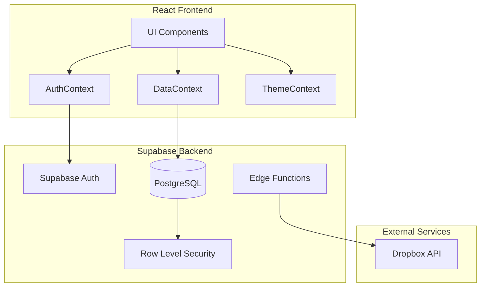
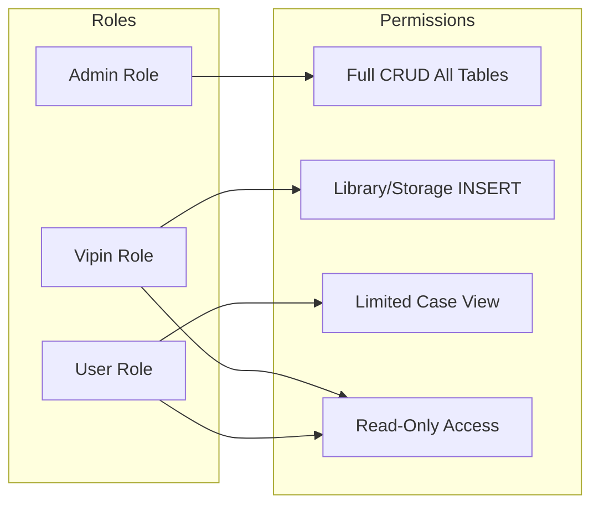

# Design Document: Katneshwarkar V2.1 Updates

## Overview

This design document specifies the architecture and implementation details for Katneshwarkar Firm Management V2.1. The system is a role-based legal case management application built with React/TypeScript frontend and Supabase backend, featuring strict access control, streamlined case creation, library/storage management, and universal search functionality.

## Architecture



### Role-Based Access Architecture



## Components and Interfaces

### Authentication Components

#### AuthContext Updates
- Add `vipin` to `UserRole` type: `'admin' | 'user' | 'vipin'`
- Update `isAdmin` to include helper `canManageLibrary` for Admin/Vipin roles
- Implement case visibility filtering based on user role

```typescript
interface AuthContextType {
  user: User | null;
  users: User[];
  isAuthenticated: boolean;
  isAdmin: boolean;
  canManageLibrary: boolean; // New: Admin or Vipin
  getVisibleCases: (cases: Case[]) => Case[]; // New: Filter by role
  // ... existing methods
}
```

### Case Management Components

#### CreateCaseForm Updates
- Make all fields optional except `assignedTo`
- Add `counselRequired` dropdown (Yes/No)
- Conditionally render `counselName` field
- Restrict `assignedTo` dropdown based on user role

```typescript
interface CaseFormData {
  clientName?: string | null;
  clientEmail?: string | null;
  clientMobile?: string | null;
  fileNo?: string | null;
  // ... all fields optional
  assignedTo: string; // Required
  counselRequired: boolean;
  counselName?: string | null;
}
```

### Library Module Components

#### LibraryBooksPage Updates
- Display columns: Book Name, Location (location_slot), Book No. (book_number)
- Restrict INSERT button visibility to Admin/Vipin roles
- Implement search across all displayed columns

```typescript
interface LibraryBook {
  id: string;
  bookName: string;
  locationSlot: string;
  bookNumber: string;
  addedBy: string;
  addedAt: Date;
}
```

### Storage Module Components

#### StoragePage (New/Updated)
- Display columns: File No., Party Name, Location, Matter No.
- Required fields: File No., Party Name, Location
- Optional field: Matter No.
- Restrict INSERT to Admin/Vipin roles

```typescript
interface StorageFile {
  id: string;
  fileNo: string; // Required
  partyName: string; // Required
  storageLocation: string; // Required
  matterNo?: string | null; // Optional
  addedBy: string;
  addedAt: Date;
}
```

### Universal Search Component

#### SearchBar Component
- Prominent placement at top of data views
- Real-time filtering as user types
- Module-aware search (different fields per module)

```typescript
interface SearchBarProps {
  value: string;
  onChange: (value: string) => void;
  placeholder?: string;
  module: 'cases' | 'library' | 'storage';
}
```

## Data Models

### Database Schema Updates

#### profiles table
```sql
ALTER TABLE public.profiles 
ADD COLUMN IF NOT EXISTS role VARCHAR(20) 
CHECK (role IN ('admin', 'user', 'vipin'));
```

#### cases table updates
```sql
ALTER TABLE public.cases
ADD COLUMN IF NOT EXISTS assigned_to UUID REFERENCES public.profiles(id),
ADD COLUMN IF NOT EXISTS counsel_required BOOLEAN DEFAULT false,
ADD COLUMN IF NOT EXISTS counsel_name VARCHAR(255);

-- Make existing required fields nullable
ALTER TABLE public.cases ALTER COLUMN client_name DROP NOT NULL;
ALTER TABLE public.cases ALTER COLUMN file_no DROP NOT NULL;
```

#### library_resources table (new/updated)
```sql
CREATE TABLE IF NOT EXISTS public.library_resources (
  id UUID PRIMARY KEY DEFAULT uuid_generate_v4(),
  book_name VARCHAR(255) NOT NULL,
  location_slot VARCHAR(50) NOT NULL,
  book_number VARCHAR(100) NOT NULL,
  added_by UUID REFERENCES public.profiles(id),
  added_at TIMESTAMPTZ DEFAULT NOW()
);
```

#### storage_files table (new)
```sql
CREATE TABLE IF NOT EXISTS public.storage_files (
  id UUID PRIMARY KEY DEFAULT uuid_generate_v4(),
  file_no VARCHAR(100) NOT NULL,
  party_name VARCHAR(255) NOT NULL,
  storage_location VARCHAR(100) NOT NULL,
  matter_no VARCHAR(100),
  added_by UUID REFERENCES public.profiles(id),
  added_at TIMESTAMPTZ DEFAULT NOW()
);
```

### Row Level Security Policies

#### Cases RLS - User Visibility
```sql
-- Users see only their created or assigned cases
CREATE POLICY "Users see own cases" ON public.cases
FOR SELECT USING (
  auth.uid() = created_by OR 
  auth.uid() = assigned_to OR
  EXISTS (SELECT 1 FROM public.profiles WHERE id = auth.uid() AND role = 'admin')
);
```

#### Library/Storage RLS - Insert Restriction
```sql
-- Only Admin and Vipin can insert
CREATE POLICY "Admin/Vipin can insert library" ON public.library_resources
FOR INSERT WITH CHECK (
  EXISTS (SELECT 1 FROM public.profiles WHERE id = auth.uid() AND role IN ('admin', 'vipin'))
);
```

### Authentication Architecture

The system uses a simple username/password authentication without external providers:

```typescript
interface LoginCredentials {
  username: string;
  password: string;
}

interface UserAccount {
  id: string;
  username: string;
  passwordHash: string; // Hashed using bcrypt or similar
  role: 'admin' | 'user' | 'vipin';
  createdAt: Date;
  createdBy: string;
  isActive: boolean;
}
```

### Admin User Management Interface

```typescript
interface UserManagementActions {
  createUser: (username: string, password: string, role: UserRole) => Promise<User>;
  updateUser: (userId: string, updates: Partial<UserAccount>) => Promise<User>;
  deleteUser: (userId: string) => Promise<void>;
  changeUserRole: (userId: string, newRole: UserRole) => Promise<User>;
  resetPassword: (userId: string, newPassword: string) => Promise<void>;
  listAllUsers: () => Promise<User[]>;
}
```

## Correctness Properties

*A property is a characteristic or behavior that should hold true across all valid executions of a system-essentially, a formal statement about what the system should do. Properties serve as the bridge between human-readable specifications and machine-verifiable correctness guarantees.*

### Property 1: Simple Login Authentication
*For any* valid username and password combination stored in the system, submitting those credentials SHALL successfully authenticate the user and grant access.
**Validates: Requirements 1.2, 1.3**

### Property 2: Invalid Credentials Rejection
*For any* invalid username or incorrect password, the authentication attempt SHALL be rejected with an appropriate error message.
**Validates: Requirements 1.4**

### Property 3: Admin User Creation
*For any* Admin user creating a new user account with valid username, password, and role, the system SHALL persist the user and allow future logins with those credentials.
**Validates: Requirements 8.2, 8.3**

### Property 4: Username Uniqueness
*For any* attempt to create a user with a username that already exists, the system SHALL reject the creation and display an error.
**Validates: Requirements 8.3**

### Property 5: Admin Role Management
*For any* Admin user modifying another user's role, the system SHALL update the role and immediately apply the new permissions.
**Validates: Requirements 8.4, 8.6**

### Property 6: Admin User Deletion
*For any* Admin user deleting a user account, the system SHALL remove the account and prevent future authentication with those credentials.
**Validates: Requirements 8.5**

### Property 7: User Case Visibility Restriction
*For any* authenticated user with standard User role and *for any* set of cases in the system, the visible cases returned by the system SHALL only include cases where the user is the original creator OR cases explicitly assigned to that user.
**Validates: Requirements 2.1** (updated from 1.3)

### Property 8: Admin Full Case Visibility
*For any* authenticated user with Admin role and *for any* set of cases in the system, the visible cases returned by the system SHALL include all cases regardless of creator or assignee.
**Validates: Requirements 9.1**

### Property 9: Case Creation with Optional Fields
*For any* case creation request with only the `assignedTo` field populated and all other fields null, the system SHALL successfully create and persist the case record.
**Validates: Requirements 2.1, 2.2** (renumbered)

### Property 10: Admin Assignment Dropdown Contains All Users
*For any* Admin user accessing the case creation form, the `assignedTo` dropdown options SHALL contain all active users in the system.
**Validates: Requirements 2.3**

### Property 11: User Assignment Dropdown Self-Only
*For any* standard User accessing the case creation form, the `assignedTo` dropdown options SHALL contain only that user's own account.
**Validates: Requirements 2.4**

### Property 12: Case Creation Round-Trip
*For any* valid case data with an assigned user, creating the case and then retrieving it SHALL return a case with the same assigned user relationship.
**Validates: Requirements 2.5**

### Property 13: Counsel Field Conditional Visibility
*For any* case form state, the counsel name field SHALL be visible if and only if `counselRequired` is set to true.
**Validates: Requirements 3.2, 3.3**

### Property 14: Counsel Data Persistence Round-Trip
*For any* case with `counselRequired=true` and a non-empty `counselName`, saving and retrieving the case SHALL preserve both the counsel_required flag and counsel_name values.
**Validates: Requirements 3.4**

### Property 16: Library Insert Permission - Authorized Roles
*For any* user with Admin or Vipin role attempting to insert a library resource, the operation SHALL succeed and the record SHALL be persisted.
**Validates: Requirements 4.2**

### Property 17: Library Insert Permission - Unauthorized Roles
*For any* user without Admin or Vipin role attempting to insert a library resource, the operation SHALL be denied with an appropriate error.
**Validates: Requirements 4.3**

### Property 18: Library Search Results Match Query
*For any* search query in the Library module, all returned results SHALL contain the search term in at least one of: Book Name, Location, or Book No. fields.
**Validates: Requirements 4.4**

### Property 19: Storage Required Fields Validation
*For any* storage entry submission by an authorized user, the system SHALL reject submissions where File No., Party Name, or Location is empty, and SHALL accept submissions where Matter No. is empty.
**Validates: Requirements 5.2, 5.3**

### Property 20: Storage Insert Permission - Unauthorized Roles
*For any* user without Admin or Vipin role attempting to insert a storage record, the operation SHALL be denied with an appropriate error.
**Validates: Requirements 5.4**

### Property 21: Storage Search Results Match Query
*For any* search query in the Storage module, all returned results SHALL contain the search term in at least one of: File No., Party Name, Location, or Matter No. fields.
**Validates: Requirements 5.5**

### Property 22: Universal Search Filter Consistency
*For any* module (Cases, Library, Storage) and *for any* search term, the filtered results SHALL be a subset of the unfiltered results, and clearing the search SHALL restore the full unfiltered dataset.
**Validates: Requirements 6.2, 6.4**

### Property 23: Appointment Persistence Round-Trip
*For any* valid appointment with date, time, and details, saving and retrieving the appointment SHALL preserve all fields.
**Validates: Requirements 7.3**

### Property 24: Appointment Chronological Ordering
*For any* list of appointments displayed to a user, the appointments SHALL be ordered chronologically by date and time.
**Validates: Requirements 7.4**

### Property 25: Admin Case Reassignment
*For any* Admin user editing a case, the system SHALL permit reassignment to any active user in the system.
**Validates: Requirements 9.3**

## Error Handling

### Authentication Errors
- Invalid credentials: Display "Invalid email or password"
- Deactivated account: Display "Account is deactivated. Please contact an administrator."
- External provider attempt: Block and display "External authentication not supported"

### Authorization Errors
- Unauthorized case access: Return 403 with "You do not have permission to view this case"
- Unauthorized library/storage insert: Return 403 with "Only Admin and Vipin users can add records"

### Validation Errors
- Missing required field (assignedTo): Display "Task assignment is required"
- Missing storage required fields: Display specific field name that is missing

### Database Errors
- Connection failure: Display "Unable to connect to server. Please try again."
- Constraint violation: Display user-friendly message based on constraint type

## Testing Strategy

### Property-Based Testing Library
The project will use **fast-check** for property-based testing in TypeScript/JavaScript.

### Test Configuration
- Minimum 100 iterations per property test
- Each property test tagged with: `**Feature: katneshwarkar-v2-updates, Property {number}: {property_text}**`

### Unit Tests
Unit tests will cover:
- Component rendering with different user roles
- Form validation logic
- Search filtering functions
- Permission checking utilities

### Property-Based Tests
Each correctness property will be implemented as a single property-based test:
- Generate random users with different roles
- Generate random case data with various field combinations
- Generate random search queries
- Verify properties hold across all generated inputs

### Integration Tests
- End-to-end case creation flow
- Role-based access control verification
- Search functionality across modules
