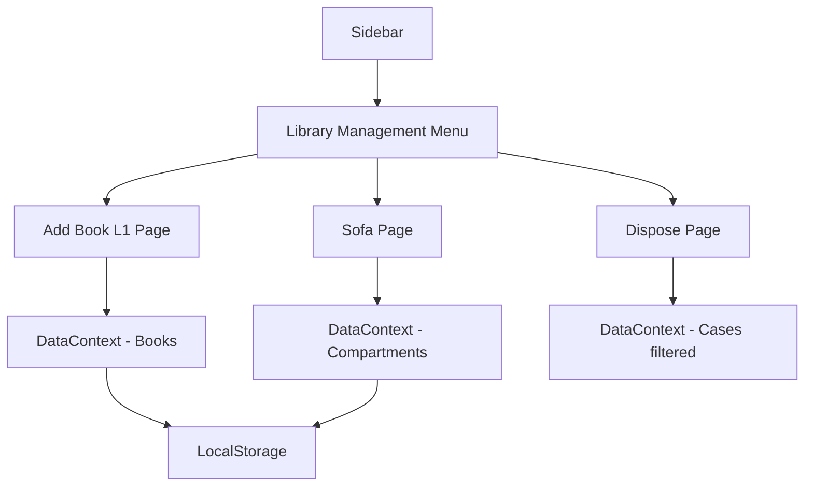

# Design Document: Library Management

## Overview

The Library Management feature extends the Legal Case Dashboard with capabilities to manage legal books, organize case files in physical storage compartments, and track disposed cases. The feature integrates with the existing case management system and follows the established patterns for data persistence and UI components.

## Architecture

The feature follows the existing React-based architecture with:
- **Pages**: Three new pages for L1 Books, Sofa Compartments, and Disposed Cases
- **Context**: Extended DataContext to manage library-related state
- **Types**: New TypeScript interfaces for Book and SofaCompartment
- **Components**: Reusable form components and list displays



## Components and Interfaces

### New Pages
1. **LibraryBooksPage** (`/library/books`) - Manage books in L1
2. **SofaPage** (`/library/sofa`) - Manage case files in C1 and C2 compartments
3. **DisposePage** (`/library/dispose`) - View disposed/closed cases

### Sidebar Integration
- Add "Library Management" expandable menu section
- Sub-items: "Add Book (L1)", "Sofa", "Dispose"
- Icons: BookOpen, Sofa, Archive

### Component Structure
```
src/
├── pages/
│   ├── LibraryBooksPage.tsx
│   ├── SofaPage.tsx
│   └── DisposePage.tsx
├── types/
│   └── index.ts (extended)
└── contexts/
    └── DataContext.tsx (extended)
```

## Data Models

### Book Interface
```typescript
interface Book {
  id: string;
  name: string;
  location: 'L1';
  addedAt: Date;
  addedBy: string;
}
```

### SofaCompartment Interface
```typescript
interface SofaItem {
  id: string;
  caseId: string;
  compartment: 'C1' | 'C2';
  addedAt: Date;
  addedBy: string;
}
```

### Extended DataContextType
```typescript
interface DataContextType {
  // ... existing properties
  books: Book[];
  sofaItems: SofaItem[];
  addBook: (name: string) => void;
  deleteBook: (id: string) => void;
  addSofaItem: (caseId: string, compartment: 'C1' | 'C2') => void;
  removeSofaItem: (id: string) => void;
  getDisposedCases: () => Case[];
}
```

## Correctness Properties

*A property is a characteristic or behavior that should hold true across all valid executions of a system-essentially, a formal statement about what the system should do. Properties serve as the bridge between human-readable specifications and machine-verifiable correctness guarantees.*

### Property 1: Adding a book with valid name increases book list
*For any* valid (non-empty, non-whitespace) book name, adding it to L1 should result in the book list length increasing by one and the book appearing in the list.
**Validates: Requirements 2.2**

### Property 2: Empty/whitespace book names are rejected
*For any* string composed entirely of whitespace characters (including empty string), attempting to add it as a book name should be rejected and the book list should remain unchanged.
**Validates: Requirements 2.4**

### Property 3: Deleting a book removes it from storage
*For any* book in the L1 list, deleting it should result in the book no longer appearing in the list and the list length decreasing by one.
**Validates: Requirements 2.5**

### Property 4: Adding case to compartment stores it correctly
*For any* valid case and compartment (C1 or C2), adding the case to that compartment should result in the case appearing in that compartment's list and being retrievable.
**Validates: Requirements 3.2, 3.3**

### Property 5: Removing case from compartment updates list
*For any* case file in a compartment, removing it should result in the case no longer appearing in that compartment's list.
**Validates: Requirements 3.5**

### Property 6: Dispose page shows only closed cases
*For any* set of cases, the Dispose page should display exactly those cases with status 'closed', and no cases with other statuses should appear.
**Validates: Requirements 4.1, 4.2**

### Property 7: Search filters disposed cases correctly
*For any* search term and set of disposed cases, the filtered results should only include cases where the client name, file number, or case type contains the search term.
**Validates: Requirements 4.4**

### Property 8: Book data persistence round-trip
*For any* book added to L1, serializing to localStorage and then deserializing should produce an equivalent book object with the same name and metadata.
**Validates: Requirements 5.1, 5.4**

### Property 9: Compartment data persistence round-trip
*For any* case file added to a compartment, serializing to localStorage and then deserializing should produce an equivalent sofa item with the same case reference and compartment.
**Validates: Requirements 5.2, 5.4**

## Error Handling

1. **Empty Book Name**: Display inline error message, prevent form submission
2. **Duplicate Book**: Allow duplicates (different physical copies)
3. **Case Already in Compartment**: Prevent adding same case to same compartment twice
4. **Invalid Case Reference**: Validate case exists before adding to compartment
5. **Storage Errors**: Display toast notification on localStorage failures

## Testing Strategy

### Unit Testing
- Test book validation logic (empty name rejection)
- Test compartment assignment logic
- Test disposed case filtering
- Test search functionality

### Property-Based Testing
Using fast-check library for property-based tests:

1. **Book Management Properties**
   - Property 1: Valid book names always add successfully
   - Property 2: Invalid names always rejected
   - Property 3: Delete always removes the book

2. **Compartment Properties**
   - Property 4: Cases added to correct compartment
   - Property 5: Removal updates compartment correctly

3. **Dispose Properties**
   - Property 6: Only closed cases shown
   - Property 7: Search filters correctly

4. **Persistence Properties**
   - Property 8: Book round-trip consistency
   - Property 9: Compartment round-trip consistency

Each property-based test will run a minimum of 100 iterations and be tagged with the format: `**Feature: library-management, Property {number}: {property_text}**`
