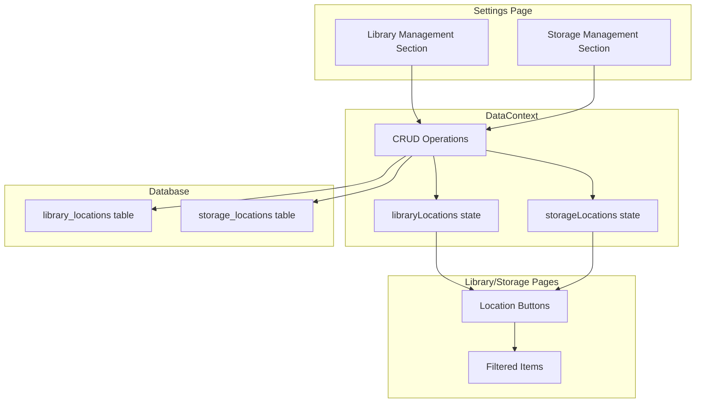

# Design Document: Library and Storage Location Management

## Overview

This feature adds Library and Storage location management to the Settings page, allowing administrators to define physical locations where items are stored. These locations appear as clickable buttons on the Library and Storage pages, enabling users to filter items by location. The implementation leverages the existing DataContext pattern for state management and follows the established UI patterns in the application.

## Architecture



## Components and Interfaces

### 1. Data Types (src/types/index.ts)

```typescript
interface LibraryLocation {
  id: string;
  name: string;
  createdBy: string;
  createdAt: Date;
}

interface StorageLocation {
  id: string;
  name: string;
  createdBy: string;
  createdAt: Date;
}
```

### 2. DataContext Extensions

New state and operations to add:
- `libraryLocations: LibraryLocation[]`
- `storageLocations: StorageLocation[]`
- `addLibraryLocation(name: string): Promise<{success: boolean; error?: string}>`
- `deleteLibraryLocation(id: string): Promise<void>`
- `addStorageLocation(name: string): Promise<{success: boolean; error?: string}>`
- `deleteStorageLocation(id: string): Promise<void>`

### 3. Settings Page Sections

Two new management sections following the existing Court/CaseType pattern:
- Library Management section with input, add button, and list with delete
- Storage Management section with input, add button, and list with delete

### 4. Location Button Component

A reusable button component for displaying locations:
```typescript
interface LocationButtonProps {
  location: LibraryLocation | StorageLocation;
  isActive: boolean;
  onClick: () => void;
  colorScheme: 'amber' | 'indigo';
}
```

### 5. Database Operations (src/lib/supabase.ts)

New database operations:
- `db.libraryLocations.getAll()`
- `db.libraryLocations.create(name, userId)`
- `db.libraryLocations.delete(id)`
- `db.storageLocations.getAll()`
- `db.storageLocations.create(name, userId)`
- `db.storageLocations.delete(id)`

## Data Models

### Library Locations Table
```sql
CREATE TABLE library_locations (
  id UUID PRIMARY KEY DEFAULT gen_random_uuid(),
  name TEXT NOT NULL,
  created_by UUID REFERENCES auth.users(id),
  created_at TIMESTAMPTZ DEFAULT NOW()
);
```

### Storage Locations Table
```sql
CREATE TABLE storage_locations (
  id UUID PRIMARY KEY DEFAULT gen_random_uuid(),
  name TEXT NOT NULL,
  created_by UUID REFERENCES auth.users(id),
  created_at TIMESTAMPTZ DEFAULT NOW()
);
```

### Updated Library/Storage Items
Add `location` field to existing LibraryItem and StorageItem interfaces to associate items with locations.

## Correctness Properties

*A property is a characteristic or behavior that should hold true across all valid executions of a system-essentially, a formal statement about what the system should do. Properties serve as the bridge between human-readable specifications and machine-verifiable correctness guarantees.*

### Property 1: Valid location names are persisted
*For any* non-empty, non-whitespace location name, adding it via the add function should result in the location appearing in the locations list with a valid ID.
**Validates: Requirements 1.2, 2.2**

### Property 2: Whitespace-only names are rejected
*For any* string composed entirely of whitespace characters (including empty string), attempting to add it as a location should return an error and not modify the locations list.
**Validates: Requirements 1.3, 2.3**

### Property 3: Added locations appear in list
*For any* successfully added location, the locations list should contain that location with matching name immediately after addition.
**Validates: Requirements 1.4, 2.4**

### Property 4: Deleted locations are removed
*For any* existing location, after deletion, the location should no longer appear in the locations list.
**Validates: Requirements 1.5, 2.5, 5.3, 5.4**

### Property 5: All locations render as buttons
*For any* set of locations in state, the Library/Storage page should render exactly that many location buttons.
**Validates: Requirements 3.1, 4.1**

### Property 6: Location filtering returns correct items
*For any* location and set of items, clicking a location button should result in displaying only items whose location field matches the selected location.
**Validates: Requirements 3.3, 4.3**

### Property 7: All location IDs are unique
*For any* set of locations, all IDs should be distinct (no duplicates).
**Validates: Requirements 5.1**

### Property 8: Locations persist across sessions (Round-trip)
*For any* set of added locations, after simulating a data reload (fetchAllData), all previously added locations should still be present with matching names.
**Validates: Requirements 5.2**

## Error Handling

| Error Scenario | Handling Strategy |
|----------------|-------------------|
| Empty location name | Return validation error, prevent submission |
| Database connection failure | Show error toast, keep local state unchanged |
| Duplicate location name | Allow (no unique constraint on name) |
| Delete non-existent location | Silently succeed (idempotent) |
| Unauthorized user attempts add/delete | Check isAdmin before showing controls |

## Testing Strategy

### Unit Tests
- Validate location name trimming and empty check
- Test location filtering logic
- Test button rendering with various location counts

### Property-Based Tests
Using fast-check library for property-based testing:

1. **Property 1 Test**: Generate random valid strings, verify they get added
2. **Property 2 Test**: Generate whitespace-only strings, verify rejection
3. **Property 3 Test**: Add locations, verify list contains them
4. **Property 4 Test**: Add then delete locations, verify removal
5. **Property 5 Test**: Generate location arrays, verify button count matches
6. **Property 6 Test**: Generate items with locations, verify filtering correctness
7. **Property 7 Test**: Add multiple locations, verify ID uniqueness
8. **Property 8 Test**: Add locations, simulate reload, verify persistence

Each property-based test will:
- Run minimum 100 iterations
- Be tagged with format: `**Feature: library-storage-locations, Property {number}: {property_text}**`
- Reference the correctness property from this design document
